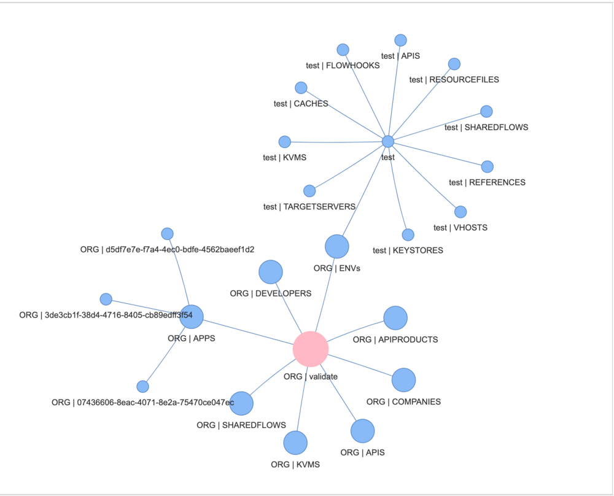

# Apigee Migration Assessment Tool

[](https://github.com/apigee/apigee-migration-assessment-tool/actions/workflows/tests.yml)

This tool helps you assess common issues that need to be addressed when
migrating from one Apigee environment to another. The core scenarios it covers
are: Apigee Edge SaaS or Edge OPDK, to Apigee X or hybrid. The output of the
assessment is a report that lists the issues detected, along with links to
documentation and information about those issues.

> _Please note_: This tool can be used as part of an effort to plan a migration
> effort. The tool does not produce a complete plan; it's not that expansive.
> It produces an assessment, limited to the Apigee artifacts.  Additional things
> that need to be considered in order to build a _plan_ for migration include
> but are not limited to: 
> * networking considerations, including  DNS, TLS, and load balancing, southbound and northbound.
> * external adjacent or connected systems like logging systems, tracing systems, Identity Provider (SAML or SSO)
> * automated tasks that perform administrative tasks by connecting to the Apigee API.
> * analytics reports or jobs that query the /stats API.  The /stats API for Apigee  changes significantly with X/hybrid.
> * monitoring and alerting configuration
> * any use of Apigee Sense

The known issues this tool will detect in Apigee configurations include:
- "skeleton key" API keys
- the use of ExtractVariables JSONPath
- Caches without expiry
- the use of an Apigee-issued Domain name in your proxies
- the use of policy types that are not supported in X/hybrid
- and a variety of others.

The tool performs this assessment by:
- conducting a scan for known issues 
- _validating_ proxies by sending the proxy definition to an Apigee X control plane.  This is currently not optional. 


Therefore, in order to run this tool, you need access to an Apigee X
organization. In the rest of this document, this will be referred to as "the
target". Despite the name, there is no actual upload or modification performed
to this organization. The Apigee X organization is used only for validation.

Though the primary goal of the tool is to assess and identify issues that may
constitute obstacles when migrating from Edge to X/hybrid, the tool ALSO can be
used to compare configurations from one hybrid or X organization to another.

## Disclaimer

This repository and its contents are not an official Google product.


## Prerequisites Summary

To run the migration assessment tool, you need:

1. an execution environment. You can run the tool directly in a shell using
   Python, or you can execute a Docker image.

2. a user or account with appropriate administrative (Readonly) access to the
   source Edge SaaS or Edge OPDK organization.

3. a user or account with appropriate administrative (Readonly) access to an
   Apigee X organization or project. The tool uses this Apigee X organization
   for realtime validation.

4. Credentials for each of the above accounts.

4. An input.properties file specifying various options for execution.

The sections below describe these in more detail.


## Prerequisites: Execution Environment

You can run this tool right from your shell, or using Docker. You do not need to run both.

* **Shell:** Requires installing Python libraries and dependencies.
* **Docker:**  You can build the image yourself, or run a pre-built image.

The advantage to using the Docker image is that you do not need to install
anything special on your workstation, other than the docker engine.


### Setup to Run from Shell

1. **Install Graphviz:** Follow the instructions for your platform at https://graphviz.org/download/

2. **Install Python venv:**

   ```bash
   python3 -m pip install virtualenv==20.24.4
   ```
3. **Create and activate a virtual environment:**
   ```bash
    python3 -m venv dev
    source dev/bin/activate
   ```
4. **Install Python dependencies:**
    ```bash
    pip install -r requirements.txt
    ```

### Setup to run from Docker 

1. **Install Docker Engine:** Follow the instructions for your platform at https://docs.docker.com/engine/install/

2. **Get a Docker Image:** 
   You need to get a Docker image.  The easiest way to do this is to pull the pre-built image:
   ```bash
   docker pull ghcr.io/apigee/apigee-migration-assessment-tool/apigee-migration-assessment-tool:latest
   ```

   Currently the only image available is tagged `latest`.

   Alternatively, you may choose to build your own Docker image.  You would do this
   if you make modifications in the source code, and yet still want to execute from
   within a container. To do this:

   ```bash
   chmod 755 requirements.txt
   docker build -t <image_name>:<tag> .
   docker push <image_name>:<tag>
   ```

   You choose the image name and tag, in this case.  For example, to use
   `migration-assessment-tool` and `v20250228` respectively,

   ```bash
   chmod 755 requirements.txt
   docker build -t migration-assessment-tool:v20250228 .
   ```


## Prerequisites: Apigee Permissions

1. **Apigee Edge SAAS/OPDK**

   The tool requires permissions to export all entities from the source Apigee Edge organization - proxies, products, KVMs, KeyStores, and so on. Hence assign the following permission to relevant user.
   * `Read-only Organization Administrator`

   Refer: [edge-built-roles](https://docs.apigee.com/api-platform/system-administration/edge-built-roles)

2. **Apigee X/Hybrid**

   The tool requires readonly permissions to an Apigee X organization, env & env objects. The tool also requires permissions to validate apis. Hence assign the below permissions to relevant user or service account.
   * A built-in role `roles/apigee.readOnlyAdmin`
   * A custom role with `apigee.proxies.create` permission
        ```bash
        gcloud iam roles create ApigeeAPIValidator --project=<PROJECT_ID> \
          --title="Apigee API Validator" --description="Apigee API Import validator" \
          --permissions="apigee.proxies.create" --stage=Alpha
        ```
    Refer: [apigee-roles](https://cloud.google.com/iam/docs/understanding-roles#apigee-roles)


## Prerequisites: Apigee Credentials/Tokens

For the principals or users you configured with the appropriate roles above, you
must now generate either a Basic Auth credential or an OAuth access token for
Apigee Edge, and an OAuth access token for Apigee X.

1. **Generate Credential for Source: Apigee Edge SAAS/OPDK/X/Hybrid**

    * Basic Auth:
    ```bash
    export SOURCE_AUTH_TOKEN=`echo -n '<username>:<password>' | base64`
    ```
    *  OAuth2/SAML:
    
        - For Apigee Edge [Apigee Edge Management API documentation](https://docs.apigee.com/api-platform/system-administration/management-api-overview) for generating OAuth2 tokens.
        ```bash
        export SSO_LOGIN_URL=https://login.apigee.com  # Example
        export SOURCE_AUTH_TOKEN=$(get_token -u <user>:<password> -m xxxx) # Example using a helper script
        ```
        - For Apigee X/Hybrid as source
        ```bash
        export SOURCE_AUTH_TOKEN=$(gcloud auth print-access-token)
        ```

2. **Generate Credential for Validation Target: Apigee X/Hybrid:**
    ```bash
    export APIGEE_ACCESS_TOKEN=$(gcloud auth print-access-token)
    ```

## Prerequisites: input.properties

Create an `input.properties` file in the **same directory** as the Python scripts.
Please find sample inputs in the `sample/inputs` folder
* [sample opdk input](sample/inputs/opdk.input.properties)
* [sample saas input](sample/inputs/saas.input.properties)
* [sample x/hybrid input](sample/inputs/x.input.properties)

Refer the below table to set the required inputs in the `input` section of `input.properties` file.

| Section  | Input                   | Description |
| -------- | ----------------------- | ----------- |
| `input`  | `SOURCE_URL`            | Apigee OPDK/Edge/X/Hybrid Management URL |
| `input`  | `SOURCE_ORG`            | Apigee OPDK/Edge Organization|
| `input`  | `SOURCE_AUTH_TYPE`      | Apigee OPDK/Edge auth type , `basic` OR `oauth`|
| `input`  | `SOURCE_UI_URL`         | Apigee OPDK/Edge UI URL, use default|
| `input`  | `SOURCE_APIGEE_VERSION` | APIGEE Flavor `OPDK` OR `SAAS` OR `X` OR `HYBRID`|
| `input`  | `TARGET_URL`            | Apigee X/Hybrid Management URL. Global or DRZ URL is supported |
| `input`  | `GCP_PROJECT_ID`        | GCP Project ID running Apigee X/Hybrd. Trial orgs are supported|
| `input`  | `API_URL`               | Apigee API url, use default |
| `input`  | `GCP_ENV_TYPE`          | Apigee X/Hybrid desired environment type |
| `input`  | `TARGET_DIR`            | Name of directory to export apigee objects |
| `input`  | `SSL_VERIFICATION`      | Set to `false` , to ignore SSL verification else set it to `true`|


## Tool Usage

* **From Shell:**

  1. **Complete Assessment**

     To assess all Apigee objects:
     ```bash
     python3 main.py --resources all
     ```

  2. **Selective Assessment**

     To assess specific Apigee objects, use the --resources flag followed by a comma-separated list:
     ```bash
     python3 main.py --resources <resource1>,<resource2>,...
     ```

     Available resources:
     * Environment Level: targetservers, keyvaluemaps, references, resourcefiles, keystores, flowhooks
     * Organization Level: org_keyvaluemaps, developers, apiproducts, apis, apps, sharedflows

     Examples:

     ```bash
     python3 main.py --resources targetservers,keyvaluemaps
     python3 main.py --resources keystores,apps
     ```

* **Docker:**
  ```bash
  mkdir output
  sudo chmod 777 output
  export DOCKER_IMAGE="<image_name>:<tag>"
  docker run --rm   -v "$(pwd)/output:/app/target" \
      -v "$(pwd)/input.properties:/app/input.properties" \
      -e SOURCE_AUTH_TOKEN=$SOURCE_AUTH_TOKEN \
      -e APIGEE_ACCESS_TOKEN=$APIGEE_ACCESS_TOKEN \
      $DOCKER_IMAGE --resources all
  ```

  Eg.
  ```bash
  mkdir output
  sudo chmod 777 output
  export DOCKER_IMAGE="ghcr.io/apigee/apigee-migration-assessment-tool/apigee-migration-assessment-tool:latest"
  docker run --rm   -v "$(pwd)/output:/app/target" \
      -v "$(pwd)/input.properties:/app/input.properties" \
      -e SOURCE_AUTH_TOKEN=$SOURCE_AUTH_TOKEN \
      -e APIGEE_ACCESS_TOKEN=$APIGEE_ACCESS_TOKEN \
      $DOCKER_IMAGE --resources all
  ```

## Accessing the Report and Visualization

1. **Assessment Report:**
    `qualification_report.xlsx` in the TARGET_DIR (specified in input.properties).

    Please find [a sample assessment](sample/outputs/sample_qualification_report.xlsx) in the [sample/outputs](sample/outputs) folder

2. **Visualization:**
    `visualization.html` in the `TARGET_DIR`. Open this file in a web browser.
    Refer the sample visualization

     .


## Contributing

We welcome contributions from the community. If you would like to contribute to
this project, please see our [Contribution Guidelines](./CONTRIBUTING.md).

## License

All solutions within this repository are provided under the
[Apache 2.0](https://www.apache.org/licenses/LICENSE-2.0) license.
Please see the [LICENSE](./LICENSE) file for more detailed terms and conditions.

## Support

This tool is open-source software, and is not a supported part of Apigee.  If
you need assistance, you can try inquiring on [the Google Cloud Community forum
dedicated to Apigee](https://goo.gle/apigee-community) There is no service-level
guarantee for responses to inquiries posted to that site.

